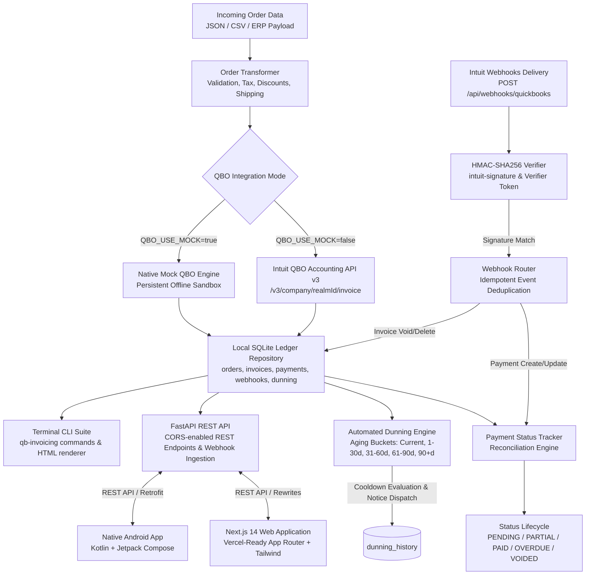
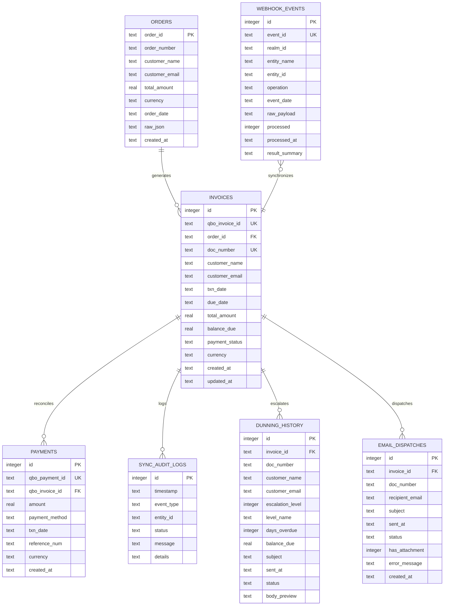

# QuickBooks Online Invoice Generator & Payment Status Tracker

[](https://github.com/breakingthebot/quickbooks-invoice-generator-build131/actions/workflows/ci.yml)
[](https://github.com/breakingthebot/quickbooks-invoice-generator-build131)
[](https://www.reportlab.com/)
[](https://github.com/lincolnloop/python-qrcode)
[](https://stripe.com)
[](https://developer.android.com/)
[](https://nextjs.org/)
[](https://www.typescriptlang.org/)
[](https://vercel.com/)
[](LICENSE)
[](https://www.python.org/)
[](https://developer.intuit.com/)
[](https://github.com/psf/black)

A production-ready QuickBooks Online (QBO) invoice generator, webhook ingestion engine, automated dunning escalation system, multi-gateway Stripe & ACH payment checkout engine, vector PDF generator with embedded instant payment QR codes, email dispatch engine, real-time payment reconciliation platform, and cross-platform enterprise ecosystem. Transforms multi-channel e-commerce, ERP, or consultation order data into Intuit QuickBooks Online Accounting API v3 invoices, manages customer synchronization, receives and cryptographically verifies QuickBooks Online webhooks (`intuit-signature`) and Stripe webhooks (`stripe-signature`) via HMAC-SHA256, categorizes outstanding receivables into aging schedule buckets, enforces dunning escalation ladders with frequency cooldown guards, maintains a local SQLite ledger with relational constraints, tracks payment lifecycles (`PENDING` -> `PARTIAL` -> `PAID`, `OVERDUE`, `VOIDED`), and provides:
1. **Vector PDF Generation Engine (`src/qb_invoicing/pdf_generator.py`)**: High-resolution vector PDF invoices via ReportLab with itemized line items, tax breakdowns, company branding, customer billing info, and audit-compliant statements.
2. **Instant Mobile-Scannable Payment QR Codes**: Scannable matrix barcodes embedded on every PDF invoice routing smartphone users directly to the hosted payment checkout portal (`/pay/{id}`).
3. **Invoice Email Dispatch Engine (`src/qb_invoicing/mailer.py`)**: MIME multipart email engine with vector PDF attachments, live STARTTLS SMTP support, zero-dependency sandbox mock testing (`MAIL_USE_MOCK=true`), and SQLite dispatch audit ledger.
4. **Multi-Gateway Payment Checkout & Stripe / ACH Auto-Settlement Engine**: Self-service Stripe Checkout sessions, hosted payment portal (`/pay/{identifier}`), ACH bank debit, cryptographic webhook listeners, and automatic reconciliation into QBO Payment entities.
5. **Native Android Mobile App (`android/`)**: Built in Kotlin 2.0 with Jetpack Compose & Material 3, providing real-time financial KPIs, AR Aging buckets, dynamic invoice generator wizard with line items repeater, instant payment settlement modal, and configurable backend endpoints.
6. **Interactive Next.js 14 Web App (`web/`)**: A production-grade React 18, TypeScript, and Tailwind CSS single-page console built with the App Router, designed for seamless one-click Vercel deployment with dynamic invoice creation, payment recording, and real-time dunning escalation.
7. **FastAPI REST API**: High-performance async REST backend with CORS support, OpenAPI documentation, and automated webhook routing.
8. **Terminal CLI Suite (`qb-invoicing`)**: Complete operational CLI for batch processing, ledger inquiries, dunning runs, Stripe checkout links, PDF exports, and email dispatches.

---

## Architecture & System Flow



### Relational Schema Diagram



---

## Automated Dunning & Accounts Receivable Aging Engine

The platform incorporates an automated overdue collections escalation engine:

### Escalation Tiers & Notice Logic
| Days Overdue | Escalation Tier | Severity | Subject / Tone |
| :--- | :--- | :--- | :--- |
| `<= 0 Days` | Current | Normal | Not overdue; no notice required |
| `1 - 14 Days` | Tier 1: Friendly Reminder | Low | Courteous notice of missed due date with invoice summary |
| `15 - 30 Days` | Tier 2: Urgent Notice | Medium | Firm prompt highlighting aging balance and disruption risk |
| `31 - 60 Days` | Tier 3: Final Demand | High | Strong demand with service suspension warning |
| `61+ Days` | Tier 4: Collections Warning | Critical | Formal pre-collections notice prior to external collection referral |

- **Frequency Cooldown Guard**: Configurable frequency cap (`DUNNING_COOLDOWN_DAYS=7`) suppresses duplicate reminder dispatches if a customer received a notice recently. Can be overridden with `--force`.
- **Responsive Email Templates**: Generates dual-format notices (plain text and responsive HTML) containing dynamic color badges, balance highlights, due dates, and direct payment portal URLs.

---

## Webhooks Engine & Cryptographic HMAC Verification

QuickBooks Online sends push notifications whenever invoices or payments are created, updated, voided, or deleted. This platform provides native enterprise webhook handling:

1. **HMAC-SHA256 Signature Verification**: Inbound requests pass the signature in header `intuit-signature`. The payload body is hashed using the shared `QBO_WEBHOOK_VERIFIER_TOKEN` secret and matched in constant time (`hmac.compare_digest`). Invalid signatures are rejected with HTTP 401 Unauthorized.
2. **Idempotent Deduplication**: Every event ID from Intuit's batch payload is recorded in `webhook_events`. Duplicate deliveries are safely acknowledged and skipped without applying duplicate accounting entries.
3. **Automated Reconciliation**:
   - Inbound `Payment` events immediately trigger ledger synchronization with QBO to reflect new balances.
   - Inbound `Invoice` `Void` / `Delete` events immediately mark the local invoice as `VOIDED` with balance zeroed.

---

## FastAPI REST API & Live Web Dashboard

Launch the web service and dashboard with a single command:
```bash
qb-invoicing serve --host 127.0.0.1 --port 8000
```

Navigate to `http://127.0.0.1:8000/` for the real-time responsive dashboard featuring:
- **Live Financial KPIs**: Total Invoiced, Outstanding Receivables, Collected Revenue, and Overdue Balances.
- **Accounts Receivable Aging Schedule Cards**: Current, 1-30 Days, 31-60 Days, 61-90 Days, and 90+ Days breakdown.
- **Interactive Dunning Escalation Button**: One-click dunning cycle execution across all open receivables.
- **Invoice Ledger Table**: Status pills (`PENDING`, `PARTIAL`, `PAID`, `OVERDUE`, `VOIDED`) and printable HTML links.
- **Live Dunning Notice & Webhook Audit Logs**: Split feeds showing recent notice dispatches and cryptographic webhook deliveries.

### API Endpoints Reference

| Method | Endpoint | Description |
| :--- | :--- | :--- |
| `GET` | `/` | Interactive Web Dashboard UI (Tailwind CSS, responsive) |
| `GET` | `/api/metrics` | Summary metrics: total invoiced, collected, outstanding, overdue, count by status |
| `GET` | `/api/invoices` | List invoices with optional `?status=` and `?limit=` filters |
| `GET` | `/api/invoices/{qbo_invoice_id}` | Retrieve single invoice details, line items, and payment history |
| `POST` | `/api/orders/generate` | Ingest order payload and generate QBO invoice |
| `POST` | `/api/invoices/{qbo_invoice_id}/payment` | Record payment against invoice and update balance |
| `GET` | `/api/invoices/{qbo_invoice_id}/html` | Render standalone printable HTML invoice document |
| `POST` | `/api/webhooks/quickbooks` | QBO Webhook ingestion endpoint with HMAC-SHA256 verification |
| `GET` | `/api/webhooks/events` | List recently ingested webhook events with status and payload |
| `POST` | `/api/invoices/{qbo_invoice_id}/checkout-session` | Generate customer-facing Stripe Checkout session (Card/ACH) |
| `POST` | `/api/webhooks/stripe` | Cryptographically verified Stripe webhook receiver (HMAC-SHA256) |
| `POST` | `/api/pay/simulate` | Sandbox simulation endpoint for instant customer payment settlement |
| `GET` | `/pay/{qbo_invoice_id}` | Customer-facing self-service payment portal page (HTML) |
| `GET` | `/pay/checkout/{session_id}` | Hosted Stripe Checkout simulation sandbox page (HTML) |
| `GET` | `/pay/success/{qbo_invoice_id}` | Customer payment confirmation and receipt acknowledgment page (HTML) |
| `GET` | `/api/dunning/aging-report` | Calculate Accounts Receivable aging schedule buckets |
| `GET` | `/api/dunning/history` | Retrieve historical dunning escalation notices |
| `POST` | `/api/dunning/run` | Execute automated dunning cycle across open invoices |
| `POST` | `/api/dunning/evaluate/{id}` | Evaluate eligibility and preview dunning notice for an invoice |
| `GET` | `/docs` | Interactive Swagger / OpenAPI documentation UI |

---

## Modern Web Application (Next.js 14 + Vercel)

The `web/` directory houses a complete, modern web frontend built with **Next.js 14 (App Router)**, **React 18**, **TypeScript**, and **Tailwind CSS**. It communicates seamlessly with the FastAPI backend and is architected for immediate **Vercel** cloud deployment.

### Key Web Features
- **Real-Time Financial Dashboard**:
  - Live metric KPI cards: Total Invoiced, Outstanding Receivables, Collected Revenue, and Overdue Balances.
  - Accounts Receivable Aging Schedule buckets: Current, 1-30 Days, 31-60 Days, 61-90 Days, 90+ Days with visual color coding.
- **Interactive "Create Invoice" Modal**:
  - Customer info fields (name, email, order ID, payment terms).
  - Dynamic line items repeater (add/remove item rows with name, quantity, unit price).
  - Configurable sales tax rate and shipping fee with real-time running subtotal and total balance calculation.
- **Payment Settlement Modal**:
  - One-click modal to record full or partial payments with method selection (`CreditCard`, `BankTransfer`, `Check`, `Cash`) and reference tracking.
- **Automated Dunning Trigger**:
  - "Run Dunning Escalation" button with confirmation alert, executing overdue evaluation and dispatching notices across all open receivables.
- **Invoice Ledger Table**:
  - Dynamic status pills (`PENDING`, `PARTIAL`, `PAID`, `OVERDUE`, `VOIDED`).
  - Quick action buttons to record payment or open printable standalone HTML invoices in a new tab.
- **Live Split Audit Feeds**:
  - Real-time side-by-side feed of recent dunning notices dispatched and cryptographic QuickBooks webhook events ingested.

### Running the Web App Locally

Ensure your FastAPI backend is running first:
```bash
qb-invoicing serve --host 127.0.0.1 --port 8000
```

Then start the Next.js development server:
```bash
cd web
npm install
npm run dev
```

Open [http://localhost:3000](http://localhost:3000) in your browser. All `/api/*` calls are automatically proxied via `next.config.mjs` to `http://127.0.0.1:8000`.

### Deploying to Vercel

The project includes a root-level `vercel.json` configured specifically for Vercel:
```json
{
  "framework": "nextjs",
  "rootDirectory": "web",
  "buildCommand": "npm run build"
}
```

#### Option A: One-Click GitHub Import
1. Push your changes to GitHub.
2. Go to [vercel.com/new](https://vercel.com/new) and import the `quickbooks-invoice-generator-build131` repository.
3. Vercel automatically detects `vercel.json` and sets the root directory to `web`.
4. In **Environment Variables**, add:
   - `NEXT_PUBLIC_API_URL`: Your deployed FastAPI backend URL (or public tunneling URL).
5. Click **Deploy**.

#### Option B: Deploy via Vercel CLI
```bash
npm i -g vercel
vercel
```

---

## Native Android Application (Kotlin & Jetpack Compose)

The `android/` directory contains a complete native Android application built with **Kotlin 2.0**, **Jetpack Compose (Material 3)**, **Retrofit 2**, **Coroutines & StateFlow**, and **ViewModel** architecture.

### Key Mobile Features
- **Executive Mobile Dashboard**:
  - Live metric KPI cards (Total Invoiced, Collected, Outstanding, Overdue).
  - Horizontal scrolling Accounts Receivable Aging Schedule card rail (Current, 1–30d, 31–60d, 61–90d, 90+d).
  - One-touch "Run Dunning Escalation" button with reactive progress indicator.
  - Active server connection indicator.
- **Invoice Ledger & Settlement**:
  - Status filter chips (`ALL`, `PENDING`, `PARTIAL`, `PAID`, `OVERDUE`, `VOIDED`) and instant text search.
  - One-click `RecordPaymentDialog` supporting Credit Card, Bank Transfer, Check, and Cash.
- **Mobile Invoice Generator**:
  - Dynamic line items repeater (add/remove rows, description, unit price, quantity).
  - Configurable Net terms (15, 30, 60 days).
  - Live subtotal, tax %, and shipping calculation.
- **Activity & Webhooks Log**:
  - Tabbed split feeds for dispatched dunning notices and QuickBooks Online webhooks.
- **Configurable Backend Endpoint**:
  - Built-in URL switcher (`Settings` icon) allowing instant connection to Android Emulator (`http://10.0.2.2:8000/`), local WiFi network (`http://192.168.x.x:8000/`), or public tunnels (e.g. ngrok).

### Running the Android App

1. Ensure the Python backend is running:
   ```bash
   qb-invoicing serve --host 0.0.0.0 --port 8000
   ```
2. Open the `android/` directory in **Android Studio** (Koala / Ladybug or newer).
3. Allow Gradle to sync.
4. Select an Android Emulator or physical device (Android 7.0+ / API 24+).
5. Click **Run** to launch on device.

### Running Android Unit Tests
```bash
cd android
.\gradlew.bat testDebugUnitTest
```

---

## Terminal Visual Preview

### Invoice Generation & Rich Output
```
┏━━━━━━━━━━━━━━━━━━┳━━━━━━━━━━━━━━━━━━━━━━━━━━━━━━━━━━━━━━━━━━━━━━━━━━━━━━━━━━━━━┓
┃ Field            ┃ Value                                                       ┃
┡━━━━━━━━━━━━━━━━━━╇━━━━━━━━━━━━━━━━━━━━━━━━━━━━━━━━━━━━━━━━━━━━━━━━━━━━━━━━━━━━━┩
│ QuickBooks ID    │ 1001                                                        │
│ Doc / Invoice #  │ INV-2026-001                                                │
│ Order ID         │ EC-8921                                                     │
│ Customer         │ Sarah Jenkins (sarah.jenkins@example.com)                   │
│ Txn Date         │ 2026-09-01                                                  │
│ Due Date         │ 2026-10-01                                                  │
│ Line Items Count │ 2                                                           │
│ Subtotal         │ $628.99 USD                                                 │
│ Shipping Fee     │ $25.00 USD                                                  │
│ Discount Total   │ -$50.00 USD                                                 │
│ Tax Amount       │ $49.21 USD                                                  │
│ Total Amount     │ $653.20 USD                                                 │
│ Balance Due      │ $653.20 USD                                                 │
│ Initial Status   │ PENDING                                                     │
└──────────────────┴─────────────────────────────────────────────────────────────┘
```

### Live Status & Payment History Inspection
```
╭─────────────────────────────── QuickBooks Invoice Status ──────────────────────────────╮
│ Invoice Number: INV-2026-001                                                          │
│ QuickBooks Online ID: 1001                                                             │
│ Associated Order ID: EC-8921                                                           │
│ Customer: Sarah Jenkins <sarah.jenkins@example.com>                                    │
│ Txn Date: 2026-09-01  |  Due Date: 2026-10-01                                          │
│                                                                                        │
│ Total Invoiced: $653.20 USD                                                            │
│ Amount Paid: $300.00 USD                                                               │
│ Balance Due: $353.20 USD                                                               │
│                                                                                        │
│ Payment Status: PARTIAL                                                                │
╰────────────────────────────────────────────────────────────────────────────────────────╯

                                  Payment History
┌────────────┬────────────┬────────────┬───────────┬─────────┐
│ Payment ID │ Txn Date   │ Method     │ Reference │  Amount │
├────────────┼────────────┼────────────┼───────────┼─────────┤
│ 5001       │ 2026-09-05 │ CreditCard │ TXN-77812 │ $300.00 │
└────────────┴────────────┴────────────┴───────────┴─────────┘
```

---

## QuickBooks Online API v3 Mapping Reference

| Incoming Order Field | QBO Accounting API v3 Target | Mapping Logic / Rules |
| :--- | :--- | :--- |
| `customer.name` | `CustomerRef.name` | Resolved via QBO Customer query or auto-created |
| `customer.qbo_customer_id` | `CustomerRef.value` | Inferred, mapped from existing, or defaulted |
| `order_id` / `order_number` | `DocNumber` | Formats as `INV-{order_id}` or explicit custom number |
| `order_date` | `TxnDate` | ISO formatted date (`YYYY-MM-DD`) |
| `due_date` | `DueDate` | Explicit date or computed via terms (`order_date + N days`) |
| `items[].name` / `description` | `Line[].Description` | Item summary description |
| `items[].unit_price` | `Line[].SalesItemLineDetail.UnitPrice` | Unit price with decimal precision |
| `items[].quantity` | `Line[].SalesItemLineDetail.Qty` | Item count |
| `items[].tax_code` | `Line[].SalesItemLineDetail.TaxCodeRef` | `TAX` or `NON` |
| `shipping_fee` | `Line[].SalesItemLineDetail` | Injected as dedicated shipping line if `> 0` |
| `discount_total` | `Line[].DiscountLineDetail` | Injected as explicit discount line if `> 0` |
| `customer.billing_address` | `BillAddr` | Formatted as QBO `PhysicalAddress` (Line1, City, State, PostalCode) |
| `customer.shipping_address`| `ShipAddr` | Formatted as QBO `PhysicalAddress` |

---

## Installation & Setup

### 1. Prerequisites
- Python 3.10, 3.11, or 3.12
- Git

### 2. Clone and Setup Environment
```bash
git clone https://github.com/breakingthebot/quickbooks-invoice-generator-build131.git
cd quickbooks-invoice-generator-build131

# Create and activate virtual environment
python -m venv venv
# On Windows:
.\venv\Scripts\activate
# On Linux/macOS:
source venv/bin/activate

# Install dependencies and CLI
pip install -r requirements.txt
pip install -e .
```

### 3. Environment Configuration
Copy the sample environment file:
```bash
cp .env.example .env
```

| Variable | Default | Description |
| :--- | :--- | :--- |
| `QBO_USE_MOCK` | `true` | When `true`, operates in high-fidelity offline sandbox mode (no credentials needed) |
| `QBO_ENVIRONMENT` | `sandbox` | `sandbox` or `production` for live Intuit API calls |
| `QBO_REALM_ID` | `9341452019482710` | Intuit QuickBooks Online Company ID |
| `QBO_ACCESS_TOKEN` | `...` | OAuth2 Bearer Access Token (for live mode) |
| `QBO_WEBHOOK_VERIFIER_TOKEN` | `sample_webhook_token_123` | Secret token provided by Intuit Developer Portal for HMAC verification |
| `DATABASE_PATH` | `storage/qbo_invoicing.db` | Local SQLite ledger file path |
| `EXPORTS_DIR` | `storage/exports` | Destination directory for exported HTML invoices |
| `DEFAULT_PAYMENT_TERMS_DAYS` | `30` | Default days added to order date for payment due date |
| `DUNNING_COOLDOWN_DAYS` | `7` | Days to suppress repeated escalation notices to same customer |
| `COMPANY_NAME` | `Acme Enterprises LLC` | Business name displayed on dunning notices |
| `COMPANY_EMAIL` | `billing@example.com` | Billing support email on dunning notices |
| `PAYMENT_PORTAL_URL` | `https://pay.example.com/invoices` | Direct online payment link inserted into dunning notices & QR codes |
| `MAIL_USE_MOCK` | `true` | When `true`, email engine simulates delivery and records in SQLite without network traffic |
| `SMTP_HOST` | `smtp.example.com` | Live SMTP server hostname |
| `SMTP_PORT` | `587` | SMTP server port (587 for STARTTLS, 465 for SSL) |
| `SMTP_USER` | `billing@example.com` | SMTP authentication username |
| `SMTP_PASSWORD` | `...` | SMTP authentication password |
| `SMTP_USE_TLS` | `true` | When `true`, establishes secure connection via STARTTLS |
| `MAIL_FROM` | `billing@example.com` | Envelope sender email address for invoice dispatches |

---

## CLI Usage Reference

The package provides the `qb-invoicing` executable CLI tool:

### 1. Check Version
```bash
qb-invoicing --version
# Outputs: qb-invoicing v1.6.0
```

### 2. Initialize Database
```bash
qb-invoicing init-db
```

### 3. Preview Order Ingestion (Without Creating QBO Invoice)
```bash
qb-invoicing preview --order samples/sample_order_ecommerce.json
```

### 4. Generate Single Invoice
```bash
qb-invoicing generate --order samples/sample_order_ecommerce.json --export-html
```

### 5. Batch Ingestion
```bash
qb-invoicing batch-generate --file samples/sample_orders_batch.json
```

### 6. Inspect Invoice Status & Payment Ledger
```bash
qb-invoicing status INV-2026-001
```

### 7. Record a Payment
```bash
qb-invoicing record-payment --invoice INV-2026-001 --amount 250.00 --method CreditCard --ref TXN-99412
```

### 8. Reconcile Open Invoices with QuickBooks Online
```bash
qb-invoicing sync-payments
```

### 9. List Tracked Invoices
```bash
qb-invoicing list-invoices --status PENDING
qb-invoicing list-invoices --status PAID
qb-invoicing list-invoices --limit 50
```

### 10. Financial KPIs & Metrics Overview
```bash
qb-invoicing metrics
```

### 11. Launch Web Dashboard & REST API Server
```bash
qb-invoicing serve --host 127.0.0.1 --port 8000
```

### 12. Simulate Inbound QuickBooks Webhook Notification
```bash
qb-invoicing simulate-webhook --entity Payment --entity-id 5001 --operation Create
qb-invoicing simulate-webhook --entity Invoice --entity-id 1001 --operation Void
```

### 13. Accounts Receivable Aging Schedule Report
```bash
qb-invoicing aging-report
qb-invoicing aging-report --as-of 2026-10-15
```

### 14. Execute Automated Dunning Escalation Cycle
```bash
# Dry run simulation without recording notices
qb-invoicing dunning-run --dry-run

# Live dunning cycle with 7-day cooldown
qb-invoicing dunning-run --cooldown-days 7

# Bypass cooldown and force notice dispatch
qb-invoicing dunning-run --force
```

### 15. Inspect Dunning Notice Audit Log
```bash
qb-invoicing dunning-history --limit 25
```

### 16. Generate Self-Service Stripe Checkout Session
```bash
qb-invoicing checkout --invoice INV-2026-001
qb-invoicing checkout --invoice 1001
```

### 17. Simulate Stripe Payment Settlement Webhook
```bash
# Settle with Credit Card
qb-invoicing simulate-stripe-payment --invoice INV-2026-001 --method card

# Settle partial amount with US Bank Account (ACH)
qb-invoicing simulate-stripe-payment --invoice 1001 --amount 250.00 --method ach
```

### 18. Export Vector PDF Invoice with Scannable QR Code
```bash
# Export invoice PDF to default storage/exports/ directory
qb-invoicing export-pdf --invoice INV-2026-001

# Export to custom destination path with specific portal payment URL
qb-invoicing export-pdf --invoice 1001 --output C:/Exports/MyInvoice.pdf --portal-url https://pay.example.com
```

### 19. Dispatch Invoice Email with PDF Attachment
```bash
# Dispatch in sandbox mock mode (audited to SQLite ledger)
qb-invoicing send-invoice --invoice INV-2026-001 --mock

# Send to explicit recipient with custom subject line via live SMTP
qb-invoicing send-invoice --invoice 1001 --to client@enterprise.com --subject "Urgent: Q3 Billing Invoice" --no-mock
```

---

## Running the Test Suite

Execute the full suite of unit and integration tests with pytest:
```bash
pytest
```

Run with verbose test outputs:
```bash
pytest -v
```

---

## License

This project is licensed under the MIT License — see the [LICENSE](LICENSE) file for details.
