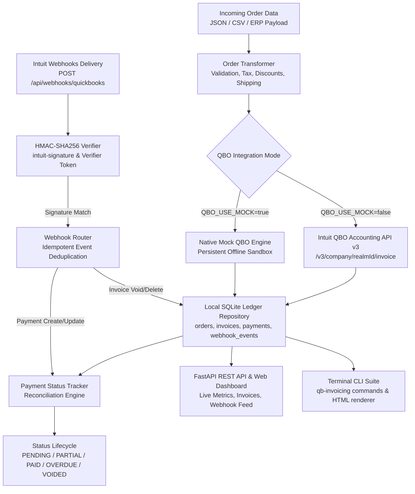
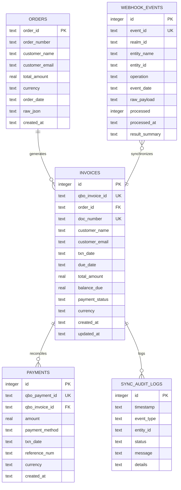

# QuickBooks Online Invoice Generator & Payment Status Tracker

[](https://github.com/breakingthebot/quickbooks-invoice-generator-build131/actions/workflows/ci.yml)
[](LICENSE)
[](https://www.python.org/)
[](https://developer.intuit.com/)
[](https://github.com/psf/black)

A production-ready QuickBooks Online (QBO) invoice generator, webhook ingestion engine, and real-time payment reconciliation platform. Transforms multi-channel e-commerce, ERP, or consultation order data into Intuit QuickBooks Online Accounting API v3 invoices, manages customer synchronization, receives and cryptographically verifies QuickBooks Online webhooks via HMAC-SHA256 (`intuit-signature`), maintains a local SQLite ledger with relational constraints, tracks payment lifecycles (`PENDING` -> `PARTIAL` -> `PAID`, `OVERDUE`), and provides both an interactive terminal CLI suite (`qb-invoicing`) and a modern FastAPI REST API with a responsive web dashboard.

---

## Architecture & System Flow



### Relational Schema Diagram



---

## Webhooks Engine & Cryptographic HMAC Verification

QuickBooks Online sends push notifications whenever invoices or payments are created, updated, voided, or deleted. This platform provides native enterprise webhook handling:

1. **HMAC-SHA256 Signature Verification**: Inbound requests pass the signature in header `intuit-signature`. The payload body is hashed using the shared `QBO_WEBHOOK_VERIFIER_TOKEN` secret and matched in constant time (`hmac.compare_digest`). Invalid signatures are rejected with HTTP 401 Unauthorized.
2. **Idempotent Deduplication**: Every event ID from Intuit's batch payload is recorded in `webhook_events`. Duplicate deliveries are safely acknowledged and skipped without applying duplicate accounting entries.
3. **Automated Reconciliation**:
   - Inbound `Payment` events immediately trigger ledger synchronization with QBO to reflect new balances.
   - Inbound `Invoice` `Void` / `Delete` events immediately mark the local invoice as `VOIDED` with balance zeroed.

---

## FastAPI REST API & Live Web Dashboard

Launch the web service and dashboard with a single command:
```bash
qb-invoicing serve --host 127.0.0.1 --port 8000
```

Navigate to `http://127.0.0.1:8000/` for the real-time responsive dashboard featuring:
- Live financial metrics: Total Invoiced, Outstanding Receivables, Collected Revenue, and Overdue Balances.
- Invoice data table with badge statuses (`PENDING`, `PARTIAL`, `PAID`, `OVERDUE`, `VOIDED`).
- One-click interactive payment modal to record payments directly in the browser.
- Live Webhook event log feed showing recent QBO push notifications and cryptographic verifications.

### API Endpoints Reference

| Method | Endpoint | Description |
| :--- | :--- | :--- |
| `GET` | `/` | Web Dashboard UI (Tailwind CSS, responsive, interactive) |
| `GET` | `/api/metrics` | Summary metrics: total invoiced, collected, outstanding, overdue, count by status |
| `GET` | `/api/invoices` | List invoices with optional `?status=` and `?limit=` filters |
| `GET` | `/api/invoices/{qbo_invoice_id}` | Retrieve single invoice details, line items, and payment history |
| `POST` | `/api/orders/generate` | Ingest order payload and generate QBO invoice |
| `POST` | `/api/invoices/{qbo_invoice_id}/payment` | Record payment against invoice and update balance |
| `GET` | `/api/invoices/{qbo_invoice_id}/html` | Render standalone printable HTML invoice document |
| `POST` | `/api/webhooks/quickbooks` | QBO Webhook ingestion endpoint with HMAC-SHA256 verification |
| `GET` | `/api/webhooks/events` | List recently ingested webhook events with status and payload |
| `GET` | `/docs` | Interactive Swagger / OpenAPI documentation UI |

---

## Terminal Visual Preview

### Invoice Generation & Rich Output
```
┏━━━━━━━━━━━━━━━━━━┳━━━━━━━━━━━━━━━━━━━━━━━━━━━━━━━━━━━━━━━━━━━━━━━━━━━━━━━━━━━━━┓
┃ Field            ┃ Value                                                       ┃
┡━━━━━━━━━━━━━━━━━━╇━━━━━━━━━━━━━━━━━━━━━━━━━━━━━━━━━━━━━━━━━━━━━━━━━━━━━━━━━━━━━┩
│ QuickBooks ID    │ 1001                                                        │
│ Doc / Invoice #  │ INV-2026-001                                                │
│ Order ID         │ EC-8921                                                     │
│ Customer         │ Sarah Jenkins (sarah.jenkins@example.com)                   │
│ Txn Date         │ 2026-09-01                                                  │
│ Due Date         │ 2026-10-01                                                  │
│ Line Items Count │ 2                                                           │
│ Subtotal         │ $628.99 USD                                                 │
│ Shipping Fee     │ $25.00 USD                                                  │
│ Discount Total   │ -$50.00 USD                                                 │
│ Tax Amount       │ $49.21 USD                                                  │
│ Total Amount     │ $653.20 USD                                                 │
│ Balance Due      │ $653.20 USD                                                 │
│ Initial Status   │ PENDING                                                     │
└──────────────────┴─────────────────────────────────────────────────────────────┘
```

### Live Status & Payment History Inspection
```
╭─────────────────────────────── QuickBooks Invoice Status ──────────────────────────────╮
│ Invoice Number: INV-2026-001                                                          │
│ QuickBooks Online ID: 1001                                                             │
│ Associated Order ID: EC-8921                                                           │
│ Customer: Sarah Jenkins <sarah.jenkins@example.com>                                    │
│ Txn Date: 2026-09-01  |  Due Date: 2026-10-01                                          │
│                                                                                        │
│ Total Invoiced: $653.20 USD                                                            │
│ Amount Paid: $300.00 USD                                                               │
│ Balance Due: $353.20 USD                                                               │
│                                                                                        │
│ Payment Status: PARTIAL                                                                │
╰────────────────────────────────────────────────────────────────────────────────────────╯

                                  Payment History
┌────────────┬────────────┬────────────┬───────────┬─────────┐
│ Payment ID │ Txn Date   │ Method     │ Reference │  Amount │
├────────────┼────────────┼────────────┼───────────┼─────────┤
│ 5001       │ 2026-09-05 │ CreditCard │ TXN-77812 │ $300.00 │
└────────────┴────────────┴────────────┴───────────┴─────────┘
```

---

## QuickBooks Online API v3 Mapping Reference

| Incoming Order Field | QBO Accounting API v3 Target | Mapping Logic / Rules |
| :--- | :--- | :--- |
| `customer.name` | `CustomerRef.name` | Resolved via QBO Customer query or auto-created |
| `customer.qbo_customer_id` | `CustomerRef.value` | Inferred, mapped from existing, or defaulted |
| `order_id` / `order_number` | `DocNumber` | Formats as `INV-{order_id}` or explicit custom number |
| `order_date` | `TxnDate` | ISO formatted date (`YYYY-MM-DD`) |
| `due_date` | `DueDate` | Explicit date or computed via terms (`order_date + N days`) |
| `items[].name` / `description` | `Line[].Description` | Item summary description |
| `items[].unit_price` | `Line[].SalesItemLineDetail.UnitPrice` | Unit price with decimal precision |
| `items[].quantity` | `Line[].SalesItemLineDetail.Qty` | Item count |
| `items[].tax_code` | `Line[].SalesItemLineDetail.TaxCodeRef` | `TAX` or `NON` |
| `shipping_fee` | `Line[].SalesItemLineDetail` | Injected as dedicated shipping line if `> 0` |
| `discount_total` | `Line[].DiscountLineDetail` | Injected as explicit discount line if `> 0` |
| `customer.billing_address` | `BillAddr` | Formatted as QBO `PhysicalAddress` (Line1, City, State, PostalCode) |
| `customer.shipping_address`| `ShipAddr` | Formatted as QBO `PhysicalAddress` |

---

## Installation & Setup

### 1. Prerequisites
- Python 3.10, 3.11, or 3.12
- Git

### 2. Clone and Setup Environment
```bash
git clone https://github.com/breakingthebot/quickbooks-invoice-generator-build131.git
cd quickbooks-invoice-generator-build131

# Create and activate virtual environment
python -m venv venv
# On Windows:
.\venv\Scripts\activate
# On Linux/macOS:
source venv/bin/activate

# Install dependencies and CLI
pip install -r requirements.txt
pip install -e .
```

### 3. Environment Configuration
Copy the sample environment file:
```bash
cp .env.example .env
```

| Variable | Default | Description |
| :--- | :--- | :--- |
| `QBO_USE_MOCK` | `true` | When `true`, operates in high-fidelity offline sandbox mode (no credentials needed) |
| `QBO_ENVIRONMENT` | `sandbox` | `sandbox` or `production` for live Intuit API calls |
| `QBO_REALM_ID` | `9341452019482710` | Intuit QuickBooks Online Company ID |
| `QBO_ACCESS_TOKEN` | `...` | OAuth2 Bearer Access Token (for live mode) |
| `QBO_WEBHOOK_VERIFIER_TOKEN` | `sample_webhook_token_123` | Secret token provided by Intuit Developer Portal for HMAC verification |
| `DATABASE_PATH` | `storage/qbo_invoicing.db` | Local SQLite ledger file path |
| `EXPORTS_DIR` | `storage/exports` | Destination directory for exported HTML invoices |
| `DEFAULT_PAYMENT_TERMS_DAYS` | `30` | Default days added to order date for payment due date |

---

## CLI Usage Reference

The package provides the `qb-invoicing` executable CLI tool:

### 1. Check Version
```bash
qb-invoicing --version
# Outputs: qb-invoicing v1.1.0
```

### 2. Initialize Database
```bash
qb-invoicing init-db
```

### 3. Preview Order Ingestion (Without Creating QBO Invoice)
```bash
qb-invoicing preview --order samples/sample_order_ecommerce.json
```

### 4. Generate Single Invoice
```bash
qb-invoicing generate --order samples/sample_order_ecommerce.json --export-html
```

### 5. Batch Ingestion
```bash
qb-invoicing batch-generate --file samples/sample_orders_batch.json
```

### 6. Inspect Invoice Status & Payment Ledger
```bash
qb-invoicing status INV-2026-001
```

### 7. Record a Payment
```bash
qb-invoicing record-payment --invoice INV-2026-001 --amount 250.00 --method CreditCard --ref TXN-99412
```

### 8. Reconcile Open Invoices with QuickBooks Online
```bash
qb-invoicing sync-payments
```

### 9. List Tracked Invoices
```bash
qb-invoicing list-invoices --status PENDING
qb-invoicing list-invoices --status PAID
qb-invoicing list-invoices --limit 50
```

### 10. Financial KPIs & Metrics Overview
```bash
qb-invoicing metrics
```

### 11. Launch Web Dashboard & REST API Server
```bash
qb-invoicing serve --host 127.0.0.1 --port 8000
```

### 12. Simulate Inbound QuickBooks Webhook Notification
```bash
qb-invoicing simulate-webhook --entity Payment --entity-id 5001 --operation Create
qb-invoicing simulate-webhook --entity Invoice --entity-id 1001 --operation Void
```

---

## Running the Test Suite

Execute the full suite of unit and integration tests with pytest:
```bash
pytest
```

Run with verbose test outputs:
```bash
pytest -v
```

---

## License

This project is licensed under the MIT License — see the [LICENSE](LICENSE) file for details.
