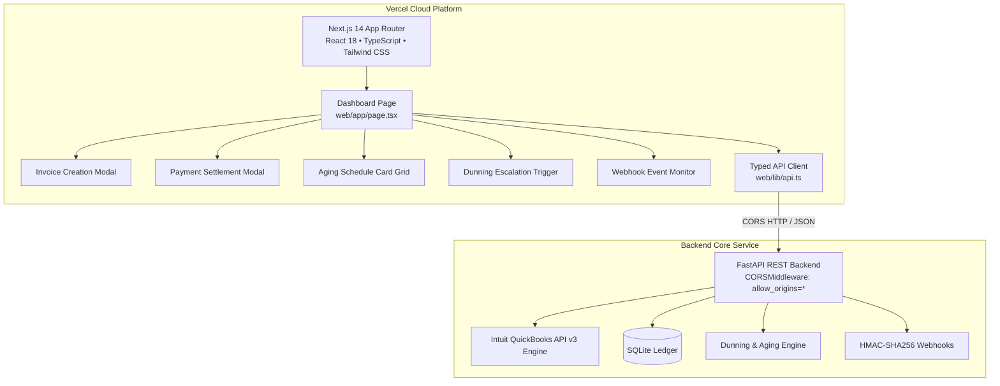

# Iteration 4: Vercel-Ready Next.js Web Application (`v1.3.0`)

## Overview & Objectives
Iteration 4 introduces a modern, production-grade Next.js 14 web application in the `web/` directory, designed and configured for zero-configuration 1-click cloud deployment to [Vercel](https://vercel.com). The web client communicates directly with the Python FastAPI backend via typed REST services and CORS middleware, providing a rich single-page experience for managing invoices, recording payments, analyzing accounts receivable aging schedules, and running automated dunning cycles.

---

## Architecture & Technology Stack

### Key Technologies
- **Framework**: Next.js 14 (App Router)
- **UI Library**: React 18 + Tailwind CSS + Lucide Icons
- **Language**: TypeScript 5.6
- **Hosting / Deploy**: Vercel (`vercel.json`)
- **API Integration**: Reverse proxy rewrites in local development (`next.config.mjs`) & typed fetch client (`web/lib/api.ts`).

---

## Key Files Introduced & Modified

### 1. `vercel.json` (Root)
Configures Vercel project settings:
- Framework: `nextjs`
- Root Directory: `web`
- Build Command: `npm run build`
- Install Command: `npm install`

### 2. `web/` Directory
- **`web/package.json`**: Dependencies for Next.js, React, Tailwind CSS, TypeScript, and Lucide icons.
- **`web/tsconfig.json`**: TypeScript compiler configuration.
- **`web/next.config.mjs`**: Next.js configuration with development proxy rewrites to FastAPI backend.
- **`web/tailwind.config.ts` & `web/app/globals.css`**: Tailwind CSS theme and styling.
- **`web/lib/api.ts`**: Complete TypeScript interfaces (`FinancialMetrics`, `InvoiceRecord`, `AgingScheduleReport`, `DunningNoticeRecord`, `WebhookEventRecord`) and async client methods (`createInvoice`, `recordPayment`, `runDunning`, `getAgingReport`).
- **`web/app/layout.tsx`**: Enterprise header navigation bar, Vercel/Next.js status badge, and documentation links.
- **`web/app/page.tsx`**: Interactive single-page application dashboard featuring:
  - Executive KPI scorecards.
  - Accounts Receivable Aging Schedule card grid.
  - Dynamic invoice creation modal with line items repeater, tax, shipping, and discount calculation.
  - Payment settlement modal for open balances.
  - One-click dunning escalation action.
  - Live split feeds for dunning audit logs and HMAC webhook events.
- **`web/README.md`**: Complete development and Vercel deployment documentation.

### 3. `src/qb_invoicing/api.py` (Enhanced)
- Added `CORSMiddleware` to allow cross-origin requests from Vercel (`https://*.vercel.app`) and local development servers (`http://localhost:3000`).

---

## Verification & Build Results
- **Python Backend**: All **43 pytest unit and integration tests** passing (7.58s).
- **Next.js Web Application**: `npm run build` compiled successfully with static prerendering and zero type errors.
